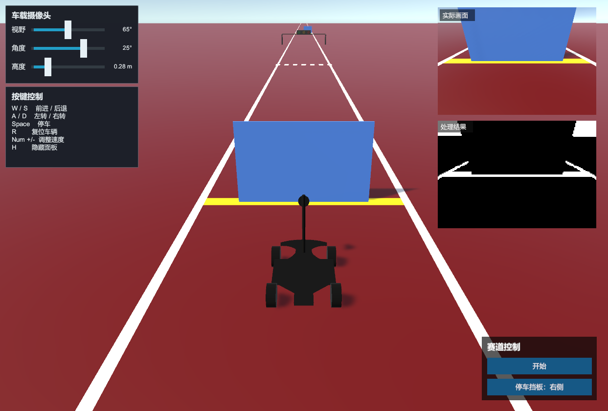
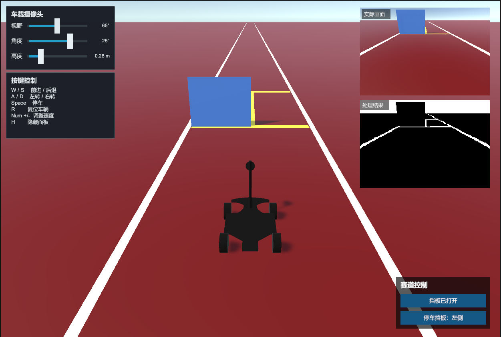

# 操场赛道车辆视觉仿真

基于 Unity 2022.3.62f1c1 构建的四轮车视觉仿真项目，用于模拟操场直线赛道、交通信号灯、斑马线、停车区和车载摄像头，并为后续接入自主视觉算法提供实时画面接口。

## 项目内容

- 红色操场赛道与白色边界线
- 黄色起点线
- 按尺寸制作的人行横道
- 赛道上方红绿灯及支撑结构
- 红绿灯支撑杆碰撞体
- 蓝色挡板和锥桶等赛道设施
- 起点挡板启动控制和停车挡板左右切换
- 四轮车模型、刚体和轮子碰撞器
- 赛道设施及车辆碰撞体
- 车载摄像头与第三视角摄像头
- 右上角车载原始画面
- 原始画面下方的视觉处理结果预览
- 可调节车载摄像头视野、俯仰角和高度
- 运行时按键提示面板

## 运行环境

- Unity `2022.3.62f1c1`
- Windows
- Built-in Render Pipeline
- Unity UGUI

## 使用方法

1. 使用 Unity Hub 打开项目目录。
2. 打开 `Assets/Scenes/SampleScene.unity`。
3. 点击 Play 运行仿真。
4. 使用以下按键控制车辆：

| 按键 | 功能 |
| --- | --- |
| `W` / `S` | 前进 / 后退 |
| `A` / `D` | 左转 / 右转 |
| `Space` | 停车 |
| `R` | 车辆复位 |
| `Num +` / `Num -` | 调整驱动力 |
| `H` | 隐藏或显示控制面板 |

运行时右下角的“赛道控制”面板提供：

- “开始”：让起点蓝色挡板平滑向上移开
- “停车挡板：左侧/右侧”：在停车区两侧切换 `61 x 50 cm` 蓝色挡板
- `R`：同时复位车辆、起点挡板和停车挡板

## 运行效果





画面右上角显示车载摄像头实际画面，下方显示视觉算法处理结果；左侧为摄像头参数和按键控制面板，右下角为赛道设施控制面板。

## 视觉算法接口

车载摄像头画面会同时显示：

- 右上方：实际车载摄像头画面
- 实际画面下方：视觉算法处理结果

默认处理算法位于：

`Assets/Scripts/UserVisionAlgorithm.cs`

当前示例实现为亮度阈值分割，用于验证图像输入和输出链路。将自己的算法写入 `Process` 方法即可：

```csharp
public void Process(
    Color32[] source,
    Color32[] destination,
    int width,
    int height)
{
    // source: 摄像头输入图像
    // destination: 处理结果图像
    // 图像尺寸默认为 160 x 120
}
```

预览与采集逻辑位于：

`Assets/Scripts/CarVisionPreview.cs`

如需接入 Python、OpenCV 或外部程序，可以在 `Process` 方法中通过 TCP、UDP、命名管道或其他接口传递图像数据。

## 主要脚本

| 脚本 | 作用 |
| --- | --- |
| `ImportedFourWheelCarController.cs` | 四轮车物理控制 |
| `ThirdPersonCarCamera.cs` | 第三视角跟随 |
| `CarCameraControlPanel.cs` | 车载摄像头参数控制 |
| `CarVisionPreview.cs` | 原始图像和处理结果预览 |
| `UserVisionAlgorithm.cs` | 用户视觉算法入口 |
| `RaceCourseInteractionManager.cs` | 起点挡板、停车挡板、复位和运行时控制面板 |

## 目录说明

```text
Assets/
  Imported/                  从其他 Unity 项目导入的车辆模型与资源
  Materials/                 场景和车辆材质
  Models/                    车辆及赛道模型
  Scenes/                    Unity 场景
  Scripts/                   控制、摄像头和视觉处理脚本
```

## 注意事项

- `Library`、`Logs`、`UserSettings` 等 Unity 生成目录不应提交到 Git。
- 项目中的大型模型和音频资源可能使仓库体积较大。
- 如果 GitHub 仓库用于公开发布，请确认模型、材质、音频和第三方资源具有可再分发许可。

## 更新日志

详细更新记录见 [CHANGELOG.md](CHANGELOG.md)。
